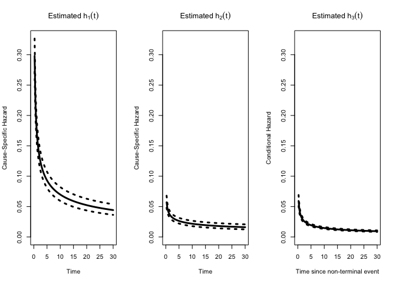
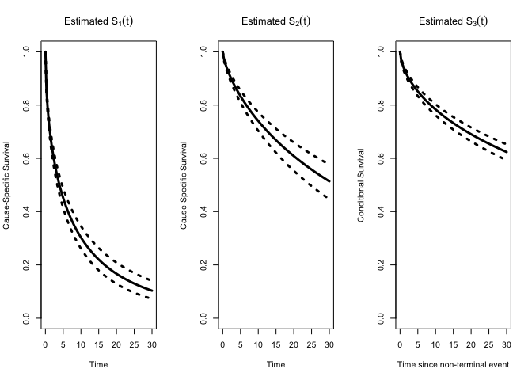

<!-- README.md is generated from README.Rmd. Please edit that file -->

# SemiCompRisksFreq

<!-- badges: start -->
<!-- badges: end -->

The goal of SemiCompRisksFreq is to fit parametric fraity-based
illness-death models for analyzing semi-competing risks data. This
package is meant as a development extension of the SemiCompRisks package
found on CRAN; whereas that package focuses on Bayesian estimation of
various illness-death models, this package focuses on frequentist
estimation, with a variety of additional features implemented for
summary and prediction. For more information, these methods have been
examined and demonstrated in (Harrison T. Reeder et al. 2019), (Harrison
T. Reeder 2022), (Harrison T. Reeder et al. 2023), and (Harrison T.
Reeder, Lu, and Haneuse 2023).

## Installation

You can install the development version of SemiCompRisksFreq from
[GitHub](https://github.com/) with:

``` r
# install.packages("devtools")
devtools::install_github("harrisonreeder/SemiCompRisksFreq")
```

## Example

This is a basic example which shows you how to solve a common problem:

``` r
library(SemiCompRisksFreq)
#> Loading required package: Formula
#> Loading required package: survival
## basic example code

#loading a data set
data(scrData)

#fitting Weibull semi-Markov illness-death model with gamma frailties
form <- Formula::Formula(time1 + event1 | time2 + event2 ~ x1 + x2 + x3 | x1 + x2 | x1 + x2)
fit_WB  <- FreqID_HReg2(Formula = form, data=scrData, model="semi-Markov",
                       extra_starts = 0,hazard = "weibull",frailty = TRUE,optim_method = c("BFGS"))

#exploring results
fit_WB
#> 
#> Analysis of independent semi-competing risks data 
#> Weibull baseline hazard specification
#> semi-Markov specification for h3
#> Confidence level: 95%
#> 
#> Variance of frailties, theta:
#>    theta       SE       LL       UL   lrtest lrpvalue 
#>    0.739    0.081    0.596    0.916  129.453    0.000 
#> SE computed from SE(log(theta)) via delta method.
#> Bounds formed for log(theta) and exponentiated.
#> Likelihood ratio test of theta=0 vs. theta>0 using mixture of chi-squareds null.
#> 
#> Regression coefficients:
#>      beta    SE     LL     UL      z pvalue
#> x1  0.234 0.038  0.160  0.308  6.194  0.000
#> x2  0.604 0.041  0.523  0.685 14.616  0.000
#> x3 -0.129 0.037 -0.202 -0.056 -3.472  0.001
#> x1  0.404 0.062  0.283  0.525  6.534  0.000
#> x2  0.723 0.066  0.593  0.853 10.924  0.000
#> x1  0.595 0.054  0.490  0.700 11.080  0.000
#> x2  0.742 0.056  0.633  0.852 13.259  0.000
#> 
#> Note: Covariates are arranged in order of transition number, 1->3.
summ.fit_WB <- summary(fit_WB); names(summ.fit_WB)
#>  [1] "HR"        "coef"      "coef_long" "theta"     "ltheta"    "h0"       
#>  [7] "h0_long"   "logLike"   "nP"        "class"     "frailty"   "alpha"    
#> [13] "knots_mat" "var_type"
summ.fit_WB
#> 
#> Analysis of independent semi-competing risks data 
#> Weibull baseline hazard specification
#> semi-Markov specification for h3
#> Confidence level: 95%
#> 
#> Variance of frailties:
#>    theta       SE       LL       UL   lrtest lrpvalue 
#>    0.739    0.081    0.596    0.916  129.453    0.000 
#> SE(theta) computed from SE(log(theta)) via delta method.
#> LL and UL computed on scale of log(theta) and exponentiated,
#> e.g., 95% UL = exp(log(theta) + 1.96 * SE(log(theta))).
#> Likelihood ratio test of theta=0 vs. theta>0 using mixture of chi-squareds null.
#> 
#> Hazard ratios:
#>    exp(beta1)    LL    UL exp(beta2)    LL    UL exp(beta3)    LL    UL
#> x1      1.264 1.174 1.361      1.498 1.327 1.691      1.813 1.632 2.014
#> x2      1.829 1.687 1.983      2.061 1.810 2.346      2.101 1.883 2.345
#> x3      0.879 0.817 0.945         NA    NA    NA         NA    NA    NA
#> 
#> Baseline hazard function components:
#>                     h1-PM    SE     LL     UL  h2-PM    SE     LL     UL  h3-PM
#> Weibull: log-kappa -1.170 0.047 -1.262 -1.079 -2.869 0.092 -3.049 -2.690 -2.792
#> Weibull: log-alpha -0.536 0.031 -0.597 -0.475 -0.323 0.045 -0.410 -0.235 -0.510
#>                       SE     LL     UL
#> Weibull: log-kappa 0.085 -2.959 -2.625
#> Weibull: log-alpha 0.035 -0.578 -0.442
pred_WB <- predict(fit_WB, tseq=seq(from=0, to=30, length.out=100))
plot(pred_WB, plot.est="Haz")
```



``` r
plot(pred_WB, plot.est="Surv")
```



<div id="refs" class="references csl-bib-body hanging-indent">

<div id="ref-reeder2022methods" class="csl-entry">

Reeder, Harrison T. 2022. “Methods for Flexible Survival Analysis and
Prediction of Semi-Competing Risks.” PhD thesis, Harvard University.

</div>

<div id="ref-reeder2023novel" class="csl-entry">

Reeder, Harrison T., Sebastien Haneuse, Anna M. Modest, Michele R.
Hacker, Leanna S. Sudhof, and Stefania I. Papatheodorou. 2023. “A Novel
Approach to Joint Prediction of Preeclampsia and Delivery Timing Using
Semicompeting Risks.” *American Journal of Obstetrics and Gynecology*
228 (3): 338.e1–12. <https://doi.org/10.1016/j.ajog.2022.08.045>.

</div>

<div id="ref-reeder2023penalized" class="csl-entry">

Reeder, Harrison T., Junwei Lu, and Sebastien Haneuse. 2023. “Penalized
Estimation of Frailty-Based Illness–Death Models for Semi-Competing
Risks.” *Biometrics* 79 (3): 1657–69.
<https://doi.org/10.1111/biom.13761>.

</div>

<div id="ref-reeder2019joint" class="csl-entry">

Reeder, Harrison T., Changyu Shen, Alfred E. Buxton, Sebastien J.
Haneuse, and Daniel B. Kramer. 2019. “Joint Shock/Death Risk Prediction
Model for Patients Considering Implantable Cardioverter-Defibrillators:
A Secondary Analysis of the SCD-HeFT Trial.” *Circulation:
Cardiovascular Quality and Outcomes* 12 (8).
<https://doi.org/10.1161/CIRCOUTCOMES.119.005675>.

</div>

</div>
